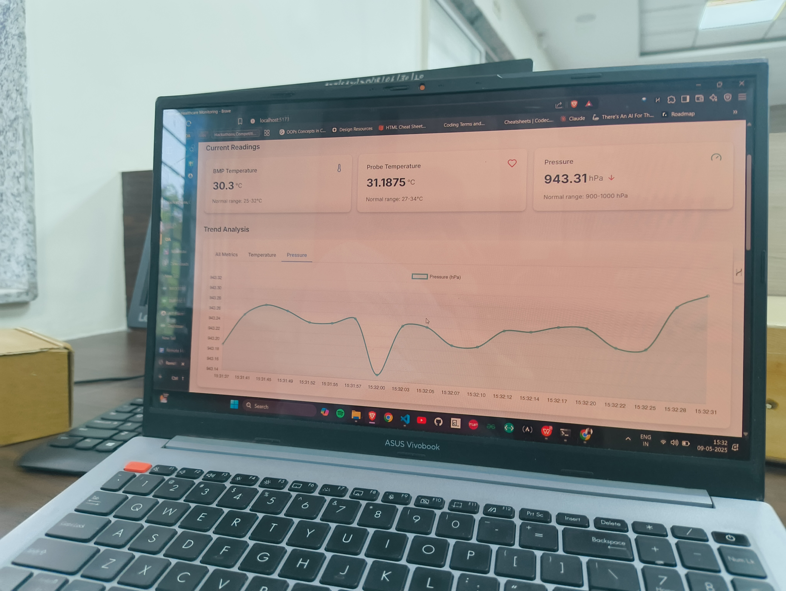
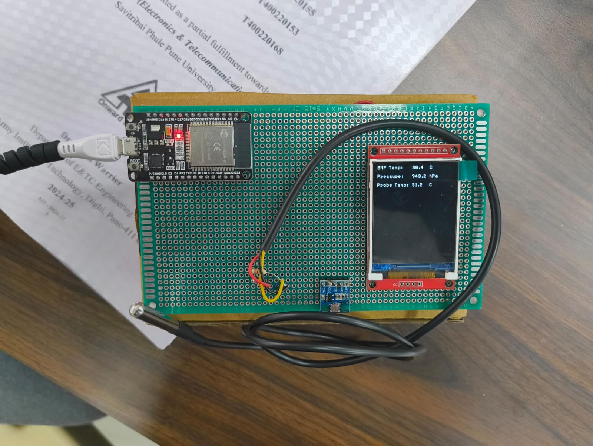

# 🩺 Remote Health Monitoring System 📊

A real-time health monitoring dashboard that collects data from sensors via ESP32 and AWS IoT, stores it in DynamoDB, and visualizes it live in the browser using WebSocket + Chart.js. 🚀
>✅ Deployed on AWS EC2 with Elastic an IP!
> 🔗 [http://13.203.253.242/](http://13.203.253.242/)

---

## 📌 Features

- 🌡️ Live Temperature & Pressure Monitoring (DS18B20, BMP280)
- 📶 ESP32-based Wireless Sensor Network
- 💾 Storage on AWS DynamoDB
- 🧠 Backend: Flask + WebSocket to serve live data
- 💻 Frontend: React + Chart.js for beautiful, responsive charts

---

## 🧱 Tech Stack

| Layer          | Technology |
|----------------|------------|
| 👨‍🔬 Sensors       | DS18B20 (Temp), BMP280 (Pressure/Alt.) |
| 🔌 Microcontroller | ESP32 (Wi-Fi + BLE) |
| ☁️ Cloud         | AWS IoT Core, AWS DynamoDB |
| 🧠 Backend       | Flask + WebSocket + Boto3 |
| 💻 Frontend      | React.js + Chart.js |

---
## 🤝 Contributors

Made with ❤️ by:

<table>
  <tr>
    <td align="center">
      <a href="https://github.com/Subratkb02">
         
        <b>Subrat Kumar Behra</b>
      </a>
    </td>
    <td align="center">
      <a href="https://github.com/sayan922">
         
        <b>Sayan Chakraborty</b>
      </a>
    </td>
  </tr>
</table>

---
## 📸 Images

Here are some visuals from the Remote Health Monitoring System in action:

  
    

  
    

  

